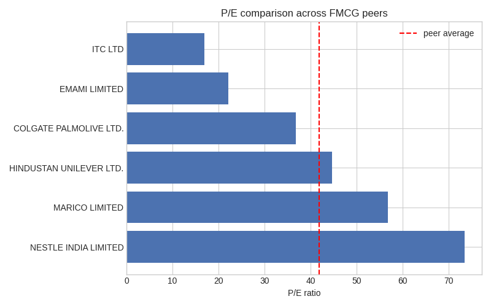

# FMCG Comps Analysis

The six tickers used:
1. HINDUNILVR.NS (Hindustan Unilever)
2. ITC.NS (ITC)
3. NESTLEIND.NS (Nestle India)
4. MARICO.NS (Marico)
5. COLPAL.NS (Colgate-Palmolive)
6. EMAMILTD.NS (Emami)

Key Findings:
1. When comparing P/E ratios across 6 FMCG companies, it turned out varying from 17x for ITC to 73.5x for Nestle India. This wide range of the ratios mainly resulted from the diversified businesses and brand strength of these companies.
2. But, the share price of Nestle and Marico seems A lot higher based on P/E and P/B ratios than the industry average. Such a scenario indicates that the investors not only anticipate more growth from the company but also are ready to pay a premium for the quality products of the company's strong brands.
3. ITC is the only company that has both of its ratios lower than the industry average. From its varied line of businesses, including its tobacco business that typically does not fetch high valuations.
